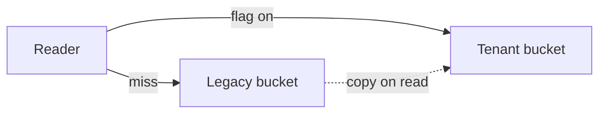

# Authoring a plan.mdx

The file is markdown with three component tags available. Everything markdown
already does stays markdown: headings, prose, lists, tables, links, blockquotes,
inline code. Reach for a component only when markdown genuinely cannot express
the thing.

## Frontmatter

```mdx
---
title: Storage Migration Review
brief: Move the associated-transcript object type onto the per-tenant bucket.
workItem: AB#12345
---
```

`title` becomes the page title and heading. `brief` is a one-line summary under
it. `workItem` renders as a chip and is omitted for standalone plans. Values are
plain text, not markdown, and quotes are stripped.

Do not open the body with an `# H1` repeating the title. Start at `##`.

## Code

A normal fenced block. The language drives highlighting; `title=` adds a filename
header:

````mdx
```csharp title=StorageResolver.cs
public IStorage Resolve(ObjectType type)
{
    return _flags.IsEnabled($"{type}_new_s3_storage") ? _tenant : _legacy;
}
```
````

Use `title=` when the reader needs to know which file they are looking at, which
is most of the time in a plan. Quote it if it contains spaces: `title="My File.cs"`.

Show the smallest fragment that carries the point. A plan is not a patch: if the
exact code is not known yet, show the shape you intend, or a stub naming what
goes in it.

## Diagrams

A `mermaid` fence:

````mdx

````

Use one when a relationship is genuinely two-dimensional: architecture, data
flow, state, sequence, ownership boundaries. Prefer `flowchart` with grouped
subgraphs or `sequenceDiagram` over a flat left-to-right chain, and use a chain
only when the thing really is sequential.

Do not add a diagram to decorate a plan. One that restates a list you already
wrote is worse than no diagram.

Keep node labels short. Mermaid is the one thing loaded from the network, pinned
and integrity-checked, and it is only fetched when a plan contains a fence like
this. Offline, the reader sees the diagram source instead, so write source that
reads sensibly on its own.

## `<FileTree>` — what the change touches

```mdx
<FileTree title="Files touched" entries={[
  { path: "src/Storage/StorageResolver.cs", change: "modified", note: "The branch that moves." },
  { path: "src/Storage/TenantBucket.cs", change: "added" },
  { path: "tests/Storage/ResolverTests.cs", change: "added" },
]} />
```

- `path` is required and repo-relative. Shared parent directories collapse
  automatically, so list paths in a sensible order and let the nesting happen.
- `change` renders as a badge: `added`, `modified`, `removed`, `renamed`.
- `note` is a short reason this file matters. Use it on the load-bearing ones and
  leave it off the obvious ones.
- `title` is optional.

List the files worth reading, not every file the change touches.

## `<Callout>` — a decision or a risk

```mdx
<Callout tone="decision">

Route through the existing provider abstraction rather than adding a migration
service. A second service would duplicate the fallback logic.

</Callout>
```

Tones: `info`, `decision`, `risk`, `warning`, `success`. Anything else falls back
to `info`.

The body is markdown and **must be separated from the tags by blank lines**, or
it renders as literal text.

Use `decision` for a call you have made and its rationale, and `risk` for
something the reader must weigh before approving. Two or three in a plan is
plenty; a page of callouts is a page with no emphasis.

## `<Tasks>` — the ordered breakdown

```mdx
<Tasks items={[
  {
    id: "reg",
    title: "Backfill container coverage for the read path",
    type: "Test",
    objective: "Capture existing resolver behaviour before it changes.",
    inputs: ["Container env with both buckets mocked"],
    outputs: ["Regression suite covering legacy reads"],
    successCriteria: ["Passes against unmodified code", "Ships in its own PR"]
  },
  {
    id: "route",
    title: "Route associated-transcript to the tenant bucket",
    type: "Functional",
    dependsOn: ["reg"],
    objective: "Resolve to the per-tenant bucket when the flag is on.",
    successCriteria: ["Flag off behaves exactly as before"]
  },
]} />
```

| Field | Notes |
|---|---|
| `id` | Short, unique. Only used for `dependsOn` and anchors. |
| `title` | What the task delivers. |
| `type` | `Functional`, `Refactor`, `Test`, `Documentation`, `Infrastructure`. Anything else renders as an unstyled badge, which is your signal it is wrong. |
| `dependsOn` | Array of other `id`s. A dependency on an unknown id is dropped. |
| `objective` | One sentence. |
| `inputs` / `outputs` | Arrays. Capabilities and preconditions, not file paths. |
| `successCriteria` | Array. |

Array fields render as bullets, strings as a paragraph. Omitted fields are not
rendered, so a sparse task stays clean rather than showing empty labels.

Items appear in array order, which is execution order. A dependency graph is
derived from `dependsOn` and rendered beneath the cards, so do not hand-author
one: it would only drift from the fields it documents.

In `/plan-tasks` mode these fields mirror
`plan-tasks/references/templates.md`, and that file is the authority on what
each one should contain.

## Things that will catch you out

- **Blank lines around block components.** A tag must start at the beginning of a
  line with a blank line before it.
- **Attributes are real JavaScript**, evaluated at render time. Trailing commas
  are fine, comments are not worth the risk, and a syntax error fails the render
  with the component and attribute named.
- **Talking about a tag in prose.** Wrap it in backticks: `` `<Tasks>` ``.
  Unquoted at the start of a line, it will be parsed.
- **An unclosed tag renders as visible escaped text** rather than vanishing, so
  if you see `<Tasks items={[` in the output, that is the bug.
- **Only `<Callout>` takes children.** `<FileTree>` and `<Tasks>` are
  self-closing.
